# agentAI

**A research-data platform for physical & embodied agents — upload any modality (images, video, GPS/IMU sensor logs), get an automatic diagnosis, then collect → review → train, all from one dashboard.**

[](https://github.com/greatroboticslab/agentAI/actions/workflows/ci.yml)


**🔗 Live platform: <https://lab-b660m-c.tailfa6424.ts.net>** — sign in with your MTSU Google account.
Runs on the lab server; reachable from the lab network / Tailscale. GPU jobs queue on PSC Bridges-2.

Built at the [MTSU Great Robotics Lab](https://github.com/greatroboticslab). Create a project for any
research field, add data of any kind, then point AI agents at it to **harvest, filter, label, and train** —
any number, any mix, or none. The dashboard runs on the lab server; GPU jobs queue on the PSC Bridges-2 cluster.

<div align="center">
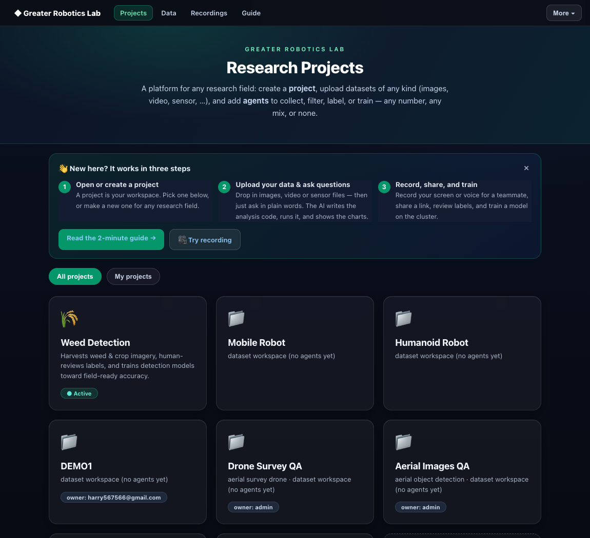
<br>
<sub>Every research domain is a <b>project</b>. Open one, or start a new one for any data type — images, video, sensor, …</sub>
</div>

**Jump to:** [5-minute demo](#-5-minute-demo--diagnose-a-robots-sensor-logs) · [Ask your data](#-ask-your-data--the-analysis-agent) · [Every modality](#-one-upload-box-every-modality) · [Autonomous agents](#-its-also-an-autonomous-agent-platform) · [Run it locally](#-run-it-locally) · [Research &amp; benchmarks](#research--benchmarks)

---

## 🚀 5-minute demo — diagnose a robot's sensor logs

A hands-on walkthrough you can **reproduce on the [live platform](https://lab-b660m-c.tailfa6424.ts.net)**.
We take one patrol robot's raw sensor logs — a **GPS track** and an **IMU** (accelerometer + gyro) — and let
the platform turn them into a *diagnosis*: how clean each signal is, what went wrong and exactly *when*, and
which sensors caught the same physical event.

> **The payoff (Step 4③):** the platform finds that at **t ≈ 60 s** the GPS and the IMU flagged trouble *at the
> same instant* — the fingerprint of a real pothole — while a bad GPS fix at 30 s and a dead IMU channel at 75 s
> each show up on **one sensor alone**. That cross-sensor agreement is something no single log can tell you.

### Step 1 — Grab the demo data

Download **[`docs/demo/patrol_multisensor.zip`](docs/demo/patrol_multisensor.zip)** (24 KB): two CSVs —
`gps.csv` (`timestamp, lat, lon, speed_mps, heading_deg`) and `imu.csv` (`timestamp, ax, ay, az, gyro_z`),
1,000 rows each at 10 Hz, sharing one clock. It's realistically-shaped driving data with **three faults
deliberately injected** so every detector has something true to find.

### Step 2 — Create a project

On the [home page](https://lab-b660m-c.tailfa6424.ts.net), click **New Project**, name it *Patrol Multisensor*,
and tick **Sensor** as the data type — or just describe your goal in plain English and let the AI propose the
setup. No config files, no code.

<div align="center">
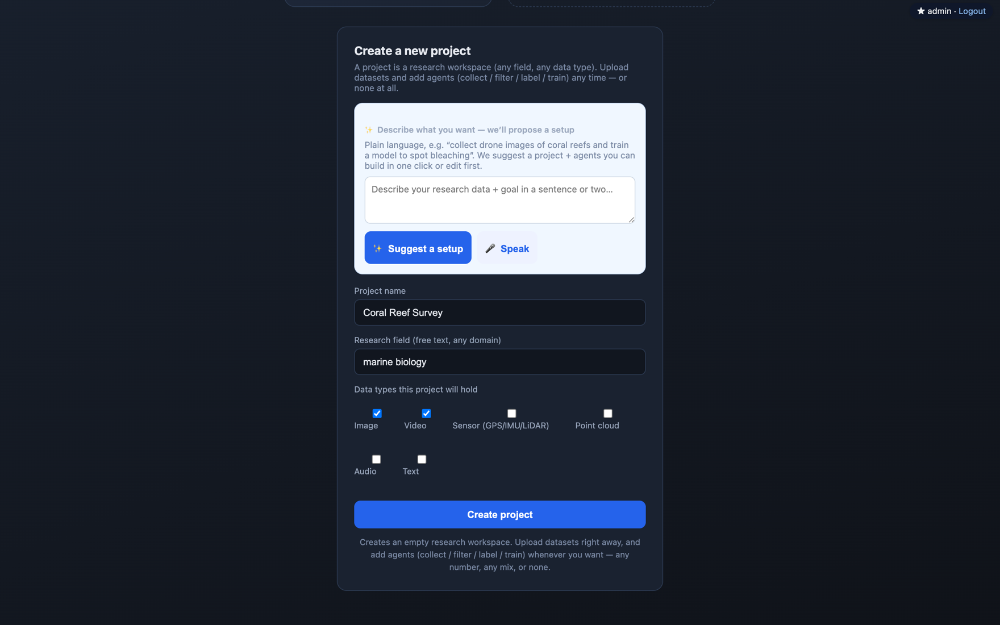
</div>

### Step 3 — Upload the logs

Open the project and drop the `.zip` onto the upload box. The platform detects both CSVs as **sensor** data and
registers the dataset. Set a **goal** — *"Find cross-sensor events where GPS and IMU agree"* — so the AI review
knows what you actually care about.

### Step 4 — Read the diagnosis

Open **Analyze**. The page is modality-aware; for sensor data it builds a three-layer diagnosis, top to bottom.

**① The route — and how clean each signal is.** The GPS track is drawn as its actual shape (colored by speed),
with a red ✕ everywhere the position jumps implausibly. Below it, every signal gets a noise score: residual
after smoothing as a % of its range, plus SNR. GPS lat/lon come back clean (0.5–0.8 %); the IMU axes read
noisier because they carry a constant gravity component with little real variation — the page *says so* instead
of crying "bad data".

<div align="center">
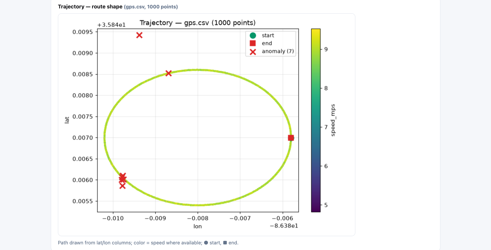
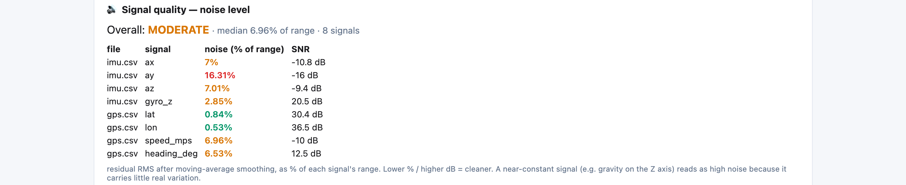
</div>

**② What went wrong — and exactly when.** Four grounded detectors — robust rapid-change (median + MAD z-score),
GPS teleports (physically implausible implied speed), sampling gaps, and stuck-sensor flatlines — each report a
**precise timestamp**. Here: a 118 m GPS jump at **30 s**, a stuck IMU `az` channel for 61 samples at **75 s**,
and a burst of activity at **60 s**.

<div align="center">
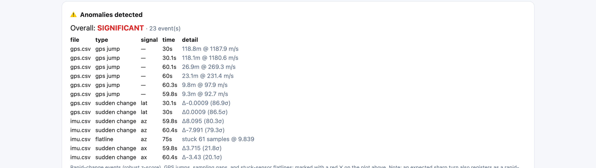
</div>

**③ Where the sensors agree — the real events.** This is the part a single sensor can't give you. Every
sensor's events go onto **one shared time axis**; a **red dashed line** marks any instant where *two or more
sensors flagged at once*. The 30 s GPS glitch and the 75 s IMU flatline each stand alone — likely sensor faults.
But at **60.03 s** the GPS jump *and* speed-drop line up with the IMU's vertical-acceleration spike: that
agreement is the fingerprint of a real **pothole**, not a glitch.

<div align="center">
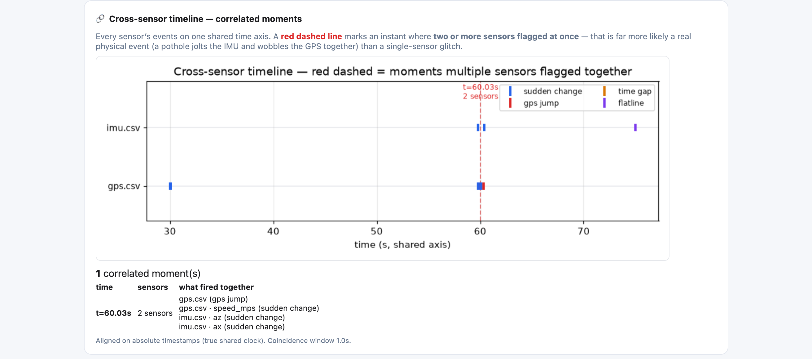
</div>

> **Honest by design.** Alignment uses the files' **absolute timestamps** (a true shared clock) when present, and
> says so on the card; otherwise it falls back to each file's own start and tells you it's *assuming* synchronized
> logging. A one-click **AI review** then narrates all of this in plain English and rates training-readiness — a
> small model runs locally on the server, a stronger cluster model is selectable per project.

### Step 5 — Ask it anything, in plain words

The standard read is just the start. Every dataset has an **Analysis agent** chat box: type a question and it
picks the analysis *for that question*. Ask *"what went wrong during the run and when?"* and it runs anomaly
detection, answering with the exact events and their timestamps — every number computed by a tool, never invented:

<div align="center">
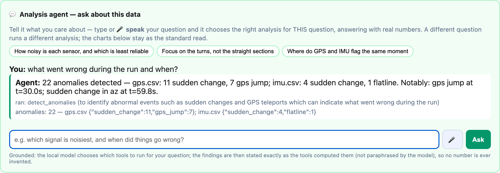
</div>

Ask a **different** question — *"where do GPS and IMU flag the same moment?"* — and it runs a *different* analysis
(cross-sensor correlation → the pothole at 60 s), with an actionable suggestion. A vague *"analyze this"* gets
guided back to concrete options instead of a canned run.

### Step 6 — …or just say it — live

Click the **🎙 mic** and **speak** your question. Transcription streams on the lab GPU (self-hosted Whisper),
so **the words appear in the box as you talk**; when you stop, the agent runs the analysis. A different spoken
question gives a different analysis — you steer it in real time, by voice.

<div align="center">
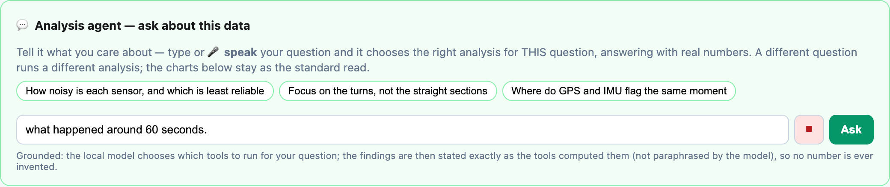
<br><sub>Words appear <b>live</b> as you speak (mic recording).</sub>
</div>

<div align="center">
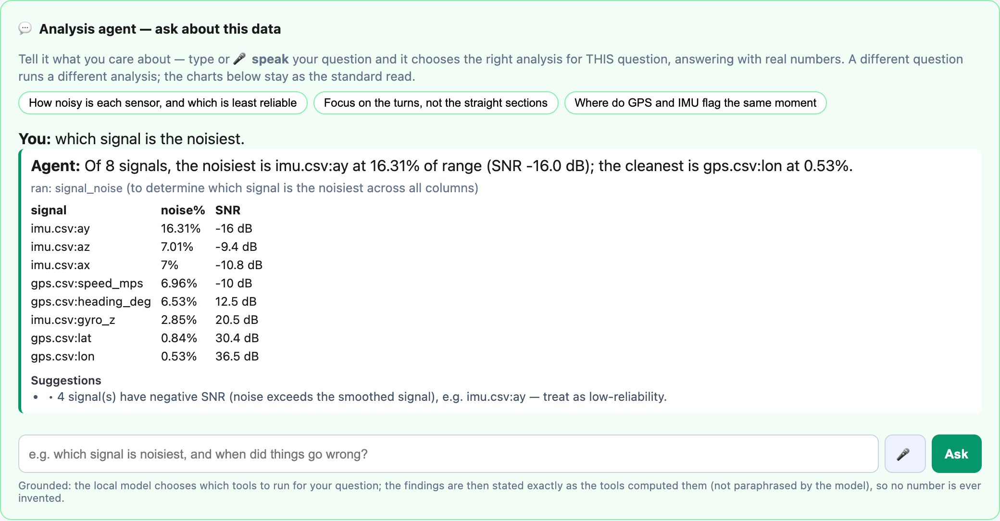
<br><sub>On stop, the agent picks the analysis for what you asked and answers with real numbers.</sub>
</div>

### Step 7 — It writes code — and hands you the keyboard

Ask for something outside the built-in analyses (*"plot a histogram of the gyroscope z axis"*) and the agent
**writes Python for your question**, runs it in a sandbox on a copy of your data, and shows the plot, the
numbers, **and the code itself — in an editable box**. Change the code and hit **▶ Run**; here the user added
a title and an extra statistic in the browser, and the re-run cross-checks the agent's own numbers:

<div align="center">
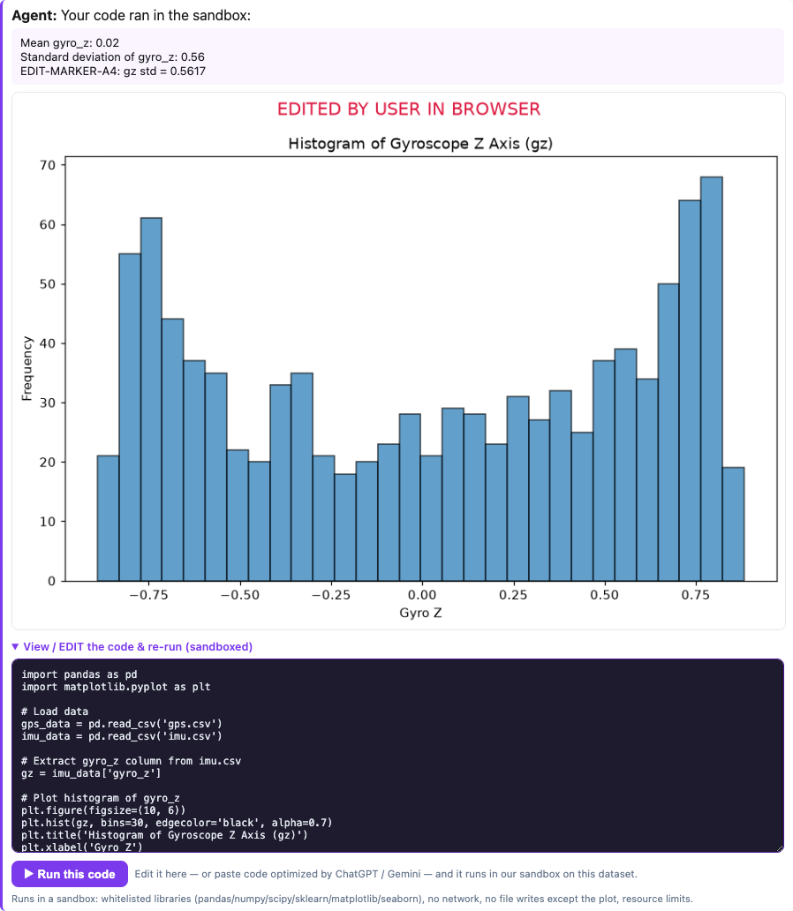
</div>

Or press **`</>`** for a blank editor and **paste code from anywhere** — e.g. take the generated code to
ChatGPT/Gemini, have it improved, paste it back — it runs in the same sandbox (whitelisted libraries incl.
seaborn, no network, no file writes except the plot, resource limits; disallowed code is rejected with the
reason, and errors come back verbatim):

<div align="center">
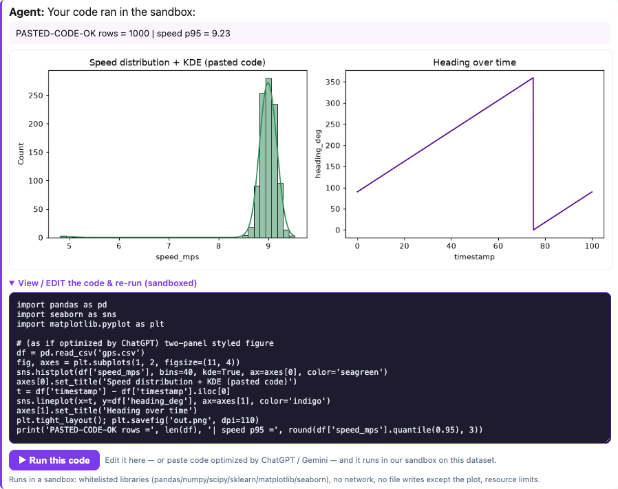
</div>

It works on **image datasets** too — a sample of the images (plus YOLO labels) is staged into the sandbox,
and the generated code reads real pixels with PIL:

<div align="center">
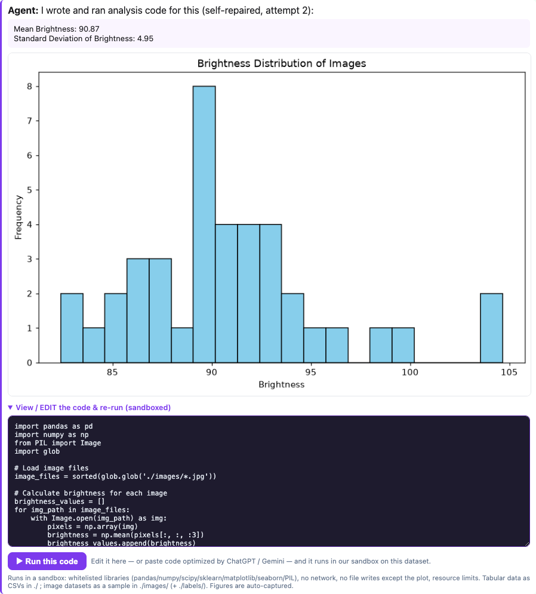
</div>

Quality-of-life, all verified live: **figures are captured automatically** (forget `plt.savefig` — the plot
still appears); a run that prints nothing and plots nothing gets a **friendly hint instead of silence**; the
conversation — questions, answers, code **and every figure** — **persists per dataset**, so reloading brings
the whole session back. **🧠 Deep** sends your question to the big open model on the cluster (async, with live
progress). And **📓 exports the entire conversation as a runnable Jupyter notebook** (.ipynb) — questions as
markdown, all code as cells — for anyone who wants the full notebook experience locally.

### Step 8 — Choose the brain: our local model, or your own GPT / Claude / Gemini

A **model menu** sits in the composer (PyCharm-style). Keep the **Local · Qwen Coder** (free, grounded, no
key) — or pick **OpenAI GPT-4o**, **Anthropic Claude**, or **Google Gemini**. Whatever you choose answers
*that* question; a commercial model **writes the analysis code, which still runs in our sandbox on your
data** — its brain, your data and execution stay on the platform.

<div align="center">
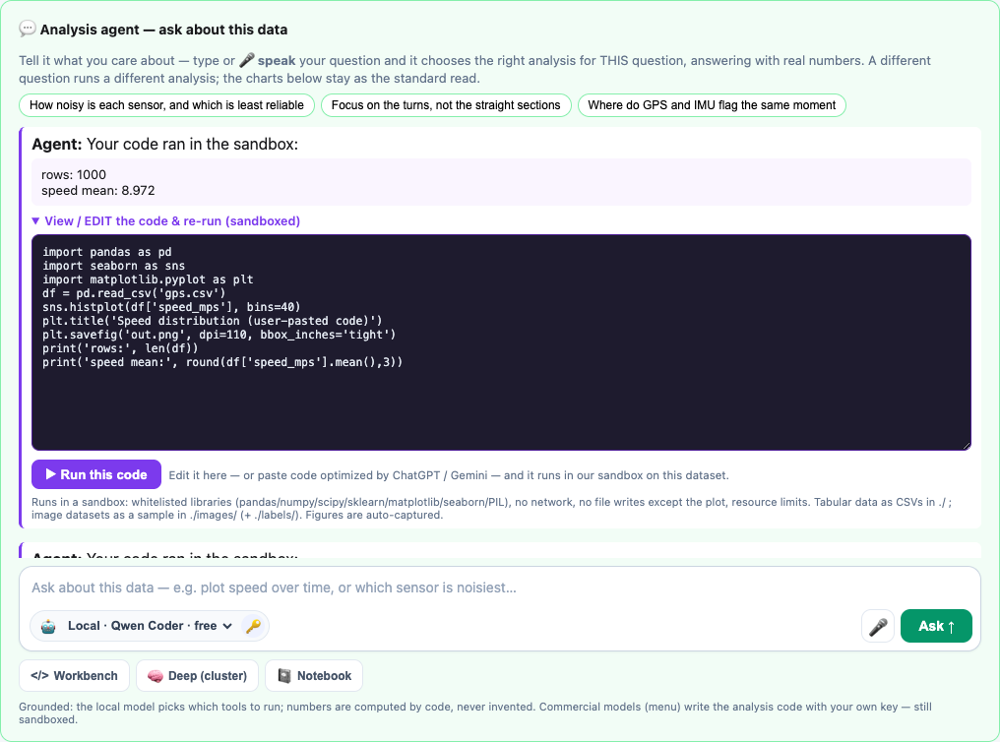
</div>

You use **your own account**: click the **🔑** button and paste your API key once. It's **encrypted on our
server, scoped to you, and never shown again** — the app only ever knows "configured / not". The key is
decrypted for a single request and never written to any shared file.

<div align="center">
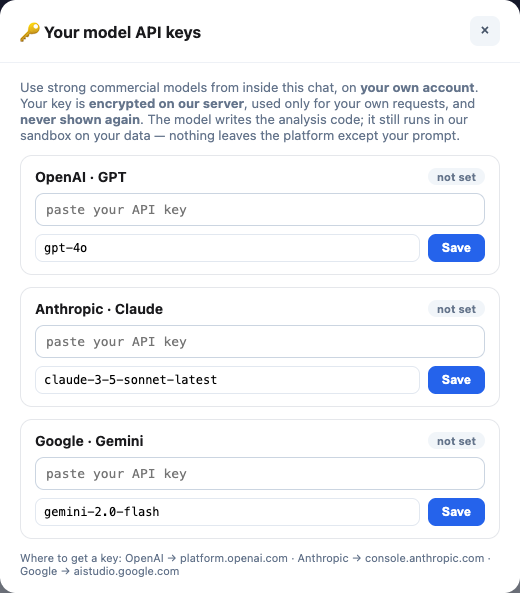
</div>

### Step 9 — Record it: screen or voice, then share a link

The **Recordings** page (top nav) captures your **screen**, **screen + mic**, **camera**, or **voice** — a
walkthrough, a demo, or a session with strong AI on any interface. A Loom-style **floating bar** (red dot,
live timer, Stop) stays visible while you work in other windows; you preview before anything uploads.
Press **Save** and it is **transcribed automatically** (self-hosted Whisper on the lab GPU) and lands in your
library with inline playback, an editable title, and a one-click **share link** (`/r/<id>`). You can also
**paste an AI share link** (ChatGPT / Claude / Gemini) to keep it with the project.

<div align="center">
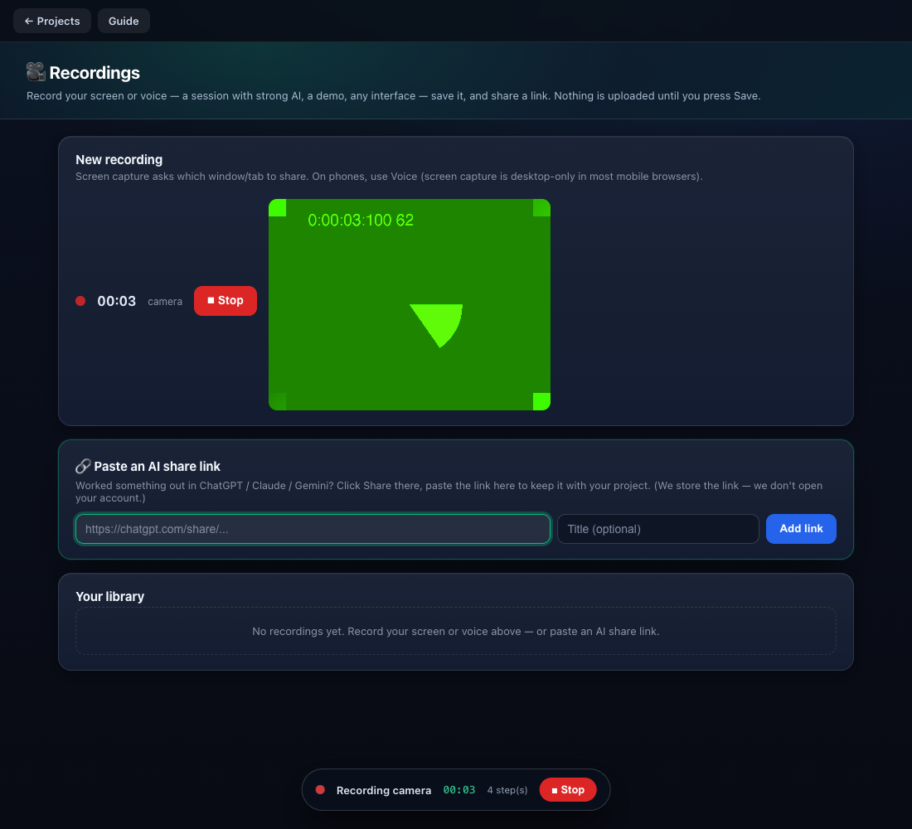
</div>

Beyond a screen recorder: every click you make on the platform while recording is captured as a timestamped
**action trace**. The share page renders it as a **clickable timeline** — click a step and the video jumps to
that moment. (A video shows *what* happened; the trace records *which control, at which second* — the
structured input an agent needs to assist or replay later.)

<div align="center">
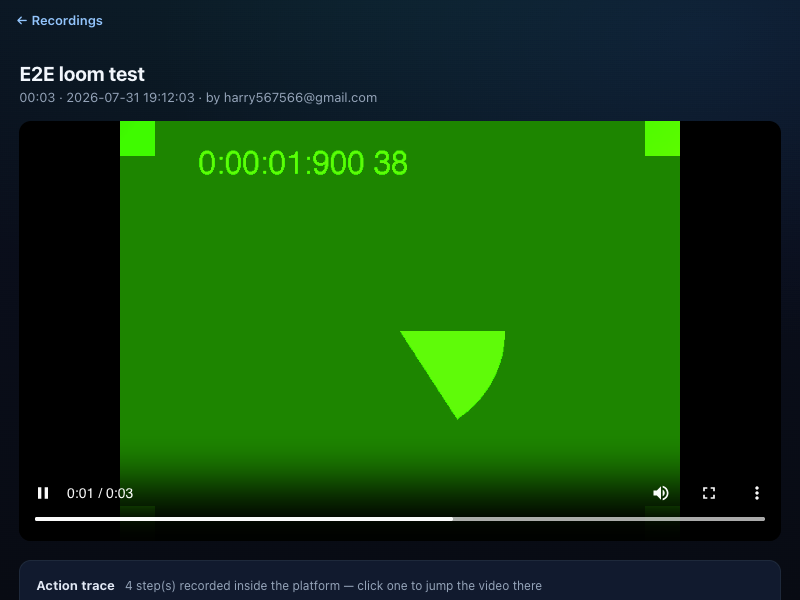
</div>

---

## 🧠 Ask your data — the analysis agent

That's the agent you just used in Steps 5–6. It works the same on **any** sensor or image dataset:

- *"which signal is noisiest?"* · *"what happened around 60 seconds?"* · *"do GPS and IMU agree anywhere?"* ·
  *"are any images blurry?"* · *"compare the first half to the second half"* — each one runs a **different**
  analysis. A vague question (*"analyze this"*) gets **guided** back to concrete options instead of a canned run.
- A small local model only **chooses which tools to run**; the findings are computed by real code — robust
  anomaly detection, cross-sensor time alignment, image blur (variance of Laplacian), class balance — and stated
  **exactly as computed**, so **no number is ever invented**. It then lists actionable **suggestions** (blurry
  images to review, unlabeled or duplicate images to fix, class imbalance, and so on).
- **Voice** runs the whole thing: the 🎙 button streams your question to self-hosted Whisper on the lab GPU —
  **the words appear live as you speak** — and on stop the agent runs the analysis. A different spoken question
  gives a different analysis, so you can **steer the analysis in real time, by voice**.

**Why not just drop the file into a general AI chat?**

| | General AI chat + a file | This analysis agent |
|---|---|---|
| **The numbers** | reads a *truncated sample*; can miscount or invent figures (worse the bigger the file) | computed by code over the **whole file**; stated exactly as computed |
| **The methods** | approximates by "reading" | real signal processing — anomaly detection, GPS-jump, **cross-sensor alignment**, Laplacian blur |
| **Reproducible** | varies run to run | same question → same computed answer; shows which tools ran, and why |
| **The data** | a throwaway conversation | a **versioned dataset** on a platform that also labels it and trains on the cluster |

*A general chat is still better for open-ended reasoning and tiny quick reads — this is grounded and specialized
for real datasets at scale, wired into the collect → label → train pipeline.*

---

## 🧩 One upload box, every modality

That sensor pipeline isn't a special case — it's the same upload box every project has. Drop a `.zip`, a folder,
images, a raw `.mp4`, or CSV logs, and the platform **auto-detects what the data is** (by content, not file
extension) and runs the analysis that fits it. Verified live with real uploads:

| You upload | Auto-detected as | The analysis page shows |
|---|---|---|
| Field photos + YOLO labels | **image** | class distribution, boxed sample previews, near-duplicate check |
| GPS / IMU logs (CSV) | **sensor** | the 3-layer diagnosis above — route, noise, anomalies, cross-sensor timeline |
| Robot camera clip (raw `.mp4`) | **video** | duration / fps / frames / resolution + 8 auto-extracted frame previews |

For image datasets you get class distribution, image-dimension stats, near-duplicates, boxed samples, and the
same one-click AI review. No `data.yaml`? Click **✎ Edit class names** and name each YOLO class right on the
page — saving writes `data.yaml` and the real names appear immediately.

<div align="center">
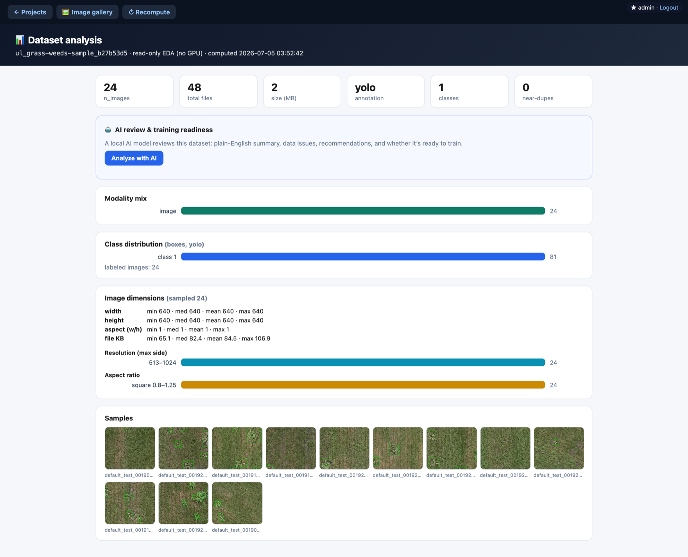
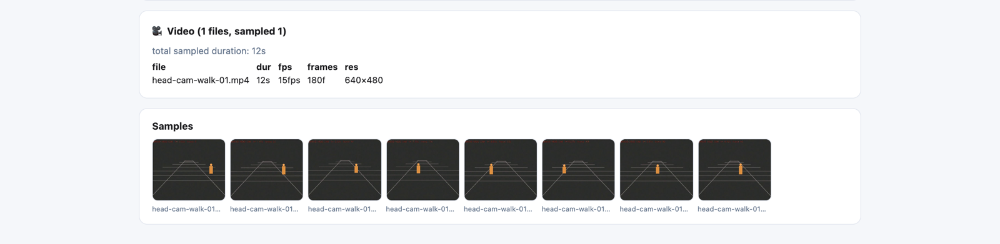
</div>

---

## 🤖 It's also an autonomous agent platform

Upload-and-analyze is the ground floor. A project can also run **agents** — any number, any mix, or none:

- **Collector** — harvests data by your queries · **Filter** — DINOv2 quality-scores it · **Labeler** — pushes to
  Roboflow for human labeling · **Trainer** — trains on the cluster GPU · **Evaluator** — runs `model.val` on a
  held-out split.
- **Compounding rounds** — each round is one `collect → filter → label → train → evaluate` pass, recorded with who
  ran it and when; evaluation metrics feed the next round's collection.
- Fill in a **research field** and the project auto-generates harvest queries and an accept-vocabulary from it — a
  new domain is config, not code. There's a built-in **2-minute guide** at `/guide`.

---

## ⚡ Run it locally

```bash
cd weed_llm_benchmark              # the package lives here
pip install -r requirements-dev.txt   # light: boots the dashboard without torch
echo mypassword > ~/.dashpass      # auth fails closed without a configured password
DASH_USER=me uvicorn weed_optimizer_framework.tools.dashboard_server:app --port 8000
# → open http://localhost:8000  (log in: me / mypassword)
```

Running tests, CI details, and contributing conventions are in **[docs/DEVELOPMENT.md](docs/DEVELOPMENT.md)**.

---

## What's in this repo

| Path | What it is |
|------|-----------|
| [`weed_llm_benchmark/`](weed_llm_benchmark/) | **The live platform** — dashboard, autonomous harvest → label → train pipeline, MongoDB, Roboflow sync. This is where active work happens. |
| [`multagent/`](multagent/) | **EMACF** robotics agent framework (Brain / Perception / Targeting / Navigation) — the earlier embodied-robot direction, kept for reference. |
| [`docs/`](docs/) | Screenshots + platform roadmap. |

> **Latest:** `v3.14` — the platform now behaves like **one app**: a single navigation bar on every page
> (plain-English labels, advanced tools under *More*, no dead ends), a **"new here?" 3-step main line** on the
> home page, and a **premium dark theme** across every screen (phone + desktop). Recent feature work:
> **Recordings** (Loom-style screen / camera / voice capture with a floating recorder bar, auto-transcription,
> share links, and a clickable **action trace** timeline), and **bring-your-own AI** — pick Local · Qwen (free)
> or your own **GPT / Claude / Gemini** key (encrypted per user) to write analysis code that still runs in our
> sandbox on your data. See [`weed_llm_benchmark/CHANGELOG.md`](weed_llm_benchmark/CHANGELOG.md)
> and [`RESEARCH_LOG.md`](RESEARCH_LOG.md).

---

## Research &amp; benchmarks

The platform grew out of two research threads. Full detail is collapsed below to keep this page usable — expand it for the architecture, the 19-model VLM benchmark, every phase, and the results tables.

<details>
<summary><b>📄 Click to expand — EMACF framework, the VLM-vs-YOLO benchmark, all phases &amp; results, tech stack, papers</b></summary>

### Origin

This repository implements **EMACF** (Embodied Multi-Agent Cognitive Framework) — a domain-agnostic agent
architecture where an LLM serves as a robot's "brain" and specialized real-time agents serve as its "body".
The same core infrastructure is designed to handle weed detection, robot navigation, human-robot interaction,
and future applications. The dataset platform above is the weed-detection domain, generalized.

### Repository structure (research view)

| Directory | Description | Status |
|-----------|-------------|--------|
| [`multagent/`](multagent/) | **EMACF core framework** — event-driven multi-agent system extending MetaGPT for real-time robot control. BrainAgent (LLM), PerceptionAgent (YOLO), TargetingAgent (laser), NavigationAgent, cloud-edge comms, real-time dashboard. | Reference |
| [`weed_llm_benchmark/`](weed_llm_benchmark/) | **Vision-LLM benchmark + dataset platform** — evaluates 19 open-source vision LLMs against YOLO on CottonWeedDet12 (5,648 images, 12 species), and hosts the live harvest/label/train platform. | Active |
| `robot_navigation/` | **Robot navigation** *(planned)* — autonomous navigation sharing the same EMACF framework. | Planned |

### Architecture overview

```
┌──────────────────────────────────────────────────────────────────┐
│                    EMACF (multagent/)                             │
│                                                                  │
│  ┌──────────┐  ┌──────────────┐  ┌───────────┐  ┌────────────┐  │
│  │  Brain    │  │  Perception  │  │ Targeting  │  │ Navigation │  │
│  │  Agent    │  │  Agent       │  │ Agent      │  │ Agent      │  │
│  │  (LLM)   │  │  (YOLO)      │  │ (Laser)    │  │ (Movement) │  │
│  └────┬─────┘  └──────┬───────┘  └─────┬─────┘  └──────┬─────┘  │
│       │               │                │               │         │
│       └───────────────┴────────────────┴───────────────┘         │
│                           EventBus                               │
│                              │                                   │
│  ┌───────────────────────────┴────────────────────────────────┐  │
│  │                    Edge Bridge (WebSocket)                  │  │
│  └────────────────────────────────────────────────────────────┘  │
└──────────────────────────────────────────────────────────────────┘
                               │
                    ┌──────────┴──────────┐
                    │   Edge Device       │
                    │   (LaserCar)        │
                    │   Camera + Laser    │
                    │   + Safety Monitor  │
                    └─────────────────────┘
```

### Key design principles

1. **Universal agent framework** — domain logic lives in agent implementations, not the core. The same `EmbodiedTeam`, `EventBus`, and `AgentRegistry` handle any task.
2. **Event-driven** — agents react to events in real time, not turn-based. The BrainAgent (LLM) only intervenes on significant events.
3. **Hot-pluggable agents** — add/remove agents at runtime via `AgentRegistry`.
4. **LLM-agnostic** — switch between vLLM, Ollama, OpenAI, or any backend via config.
5. **Cloud-edge separation** — heavy compute (YOLO, LLM) on cloud GPU; edge device handles only hardware I/O with independent safety fallback.

### Progress — EMACF framework (`multagent/`)

| Component | Status | Description |
|-----------|--------|-------------|
| Core Framework | Done | `EmbodiedTeam`, `EventBus`, `AgentRegistry`, `EdgeBridge` |
| BrainAgent | Done | LLM-based cognitive center with memory and self-optimization |
| PerceptionAgent | Done | YOLO11n detection + tracking + noise filtering + trajectory prediction |
| TargetingAgent | Done | Coordinate transform + firing control + laser patterns |
| NavigationAgent | Done | Mode management + vehicle commands |
| Dashboard | Done | Vue 3 real-time visualization (live feed, agent status, metrics) |
| Edge Client | Done | Camera streaming, command execution, safety monitor |

### Progress — Weed LLM benchmark (`weed_llm_benchmark/`)

| Phase | Status | Description |
|-------|--------|-------------|
| Phase 0: Evaluation Module | Done | `evaluate.py` (mAP, precision, recall), `datasets.py`, format converters |
| Phase 1: YOLO Baseline | **Done** | YOLO11n fine-tuned on CottonWeedDet12 — mAP@0.5=**0.929**, P=0.930, R=0.850 |
| Phase 2: Full LLM Benchmark | **Done** | 15 models evaluated on CottonWeedDet12 (9 with mAP > 0) |
| Phase 3: YOLO+LLM Fusion | **Done** | Only OWLv2 filter improves YOLO (+0.018 F1); LLMs cannot rescue YOLO misses |
| Phase 3B: Cross-Species Generalization | **Done** | YOLO drops 27% on unseen species; Florence-2 precision exceeds YOLO; LLM augmentation +0.009 F1 |
| Phase 3C: Anti-Forgetting Methods | **Done** | All simple methods fail; label quality (SAM+Depth) is the bottleneck |
| Phase 3D: SAM+Depth Enhanced Labeling | **Done** | SAM+Florence-2 caption: worse (-6.8% old, -11% new); caption classification too noisy |
| Phase 3E: Agent Optimizer | **Done** | **First improvement!** Florence+OWLv2 consensus: +0.016 F1 on unseen species, -0.020 forgetting |
| Phase 3F: Florence-2 Fine-tune | **Done** | Negative: fine-tuning degraded both old (-11%) and new species |
| Phase 4: HyperAgent Closed-Loop | **Done** | Qwen2.5-7B Brain: 3 rounds executed, system works but Brain needs stronger reasoning |
| Phase 4B: Weed Optimizer Framework | **Done** | 14 files, 3,522 lines. Ollama function calling, job chain, plant.id API, HuggingFace model discovery. |
| Phase 4C: Clone + Train External Models | **Done** | YOLOv8s trained from COCO→CottonWeed: F1=0.888; DETR zero-shot: F1=0; YOLO11n baseline: F1=0.917 |
| Phase 4D: plant.id Integration | **Done** | API key configured, local test OK (Status 201). Cluster needs pre-cache. 49 credits left. |
| Phase 4E: DeepSeek-R1 Brain | **Done** | 7 action types (vs Qwen's 1). Autonomously searched HuggingFace + downloaded models. |
| Phase 4F: Extended Run (6h48m) | **Done** | 7 rounds autonomous. Filter removed 16.3% label noise. Brain reasoning loop validated. |
| Phase 4G: Anti-Forgetting (LoRA + freeze + distill) | **Done** | Hybrid LoRA: 37 Conv2d layers, 38.15% params. Near-zero mAP forgetting. |
| Phase 4H: Gemma 4 Brain + Evaluator Fix | **Done** | Gemma 4 31B (MoE). Corrected evaluator (dual-conf). New mAP50: +9.7%, old mAP50: -0.6%. |
| Phase 5: Dataset platform (dashboard, provenance, multi-domain) | **Active** | The platform shown at the top of this page. |
| Paper writing | Planned | Figures, tables, manuscript |

#### Benchmark results (CottonWeedDet12, 848 test images)

| Model | Type | mAP@0.5 | mAP@0.5:0.95 | Precision | Recall | F1 | Time |
|-------|------|---------|--------------|-----------|--------|-----|------|
| **YOLO11n** (fine-tuned) | Detector | **0.929** | **0.865** | 0.930 | 0.850 | 0.888 | — |
| Florence-2-base (0.23B) | VLM | **0.434** | **0.392** | **0.789** | 0.519 | 0.626 | 558s |
| Florence-2-large (0.77B) | VLM | 0.329 | 0.302 | 0.692 | 0.431 | 0.531 | 662s |
| InternVL2-8B | VLM | 0.208 | 0.091 | 0.545 | 0.354 | 0.429 | 3838s |
| Qwen2.5-VL-3B | VLM | 0.196 | 0.068 | 0.333 | 0.249 | 0.285 | 5898s |
| MiniCPM-V-4.5 | VLM | 0.192 | 0.043 | 0.407 | 0.340 | 0.371 | 6595s |
| OWLv2-large | Detector | 0.184 | 0.117 | 0.194 | **0.943** | 0.322 | 2519s |
| Qwen2.5-VL-7B | VLM | 0.176 | 0.059 | 0.334 | 0.214 | 0.261 | 6047s |
| InternVL2-2B | VLM | 0.002 | 0.001 | 0.038 | 0.025 | 0.031 | 2094s |
| InternVL2.5-8B | VLM | 0.000 | 0.000 | 0.016 | 0.001 | 0.001 | 6238s |
| Grounding-DINO-base | Detector | 0.000 | 0.000 | — | — | — | 843s |
| Llama 3.2 Vision 11B | VLM | 0.000 | 0.000 | 0.005 | 0.007 | 0.006 | 11370s |
| Moondream / Molmo / LLaVA | VLM | 0.000 | 0.000 | — | — | — | — |

### Technology stack

| Component | Technology |
|-----------|-----------|
| Agent Framework | MetaGPT (extended for embodied AI) |
| Backend | FastAPI + asyncio + WebSocket |
| Object Detection | Ultralytics YOLO11n (fine-tuned on CottonWeedDet12) |
| LLM Integration | vLLM / Ollama / OpenAI-compatible APIs |
| Dashboard | Server-rendered FastAPI (platform) + Vue 3 + ECharts (robot demo) |
| Storage | MongoDB + append-only JSON registry + Roboflow (labeling surface) |
| Hardware | HeliosDAC (laser) + ESP32 (motor/laser control) |
| Compute Cluster | PSC Bridges-2 (V100 GPUs) |

### Papers

1. **"Universal Embodied Multi-Agent Cognitive Framework for Agricultural Robotics"** — EMACF architecture (targeting *Scientific Reports*)
2. **"Can Vision LLMs Detect Weeds? A Benchmark of Open-Source Multimodal Models for Agricultural Object Detection"** — VLM benchmark (targeting *Computers and Electronics in Agriculture*)

### Per-project docs

- [`multagent/README.md`](multagent/README.md) — EMACF setup and usage
- [`weed_llm_benchmark/README.md`](weed_llm_benchmark/README.md) — platform + benchmark framework documentation

</details>

---

## License

Proprietary — research use only. © 2026 MTSU Great Robotics Lab, all rights reserved. See [LICENSE](LICENSE).
