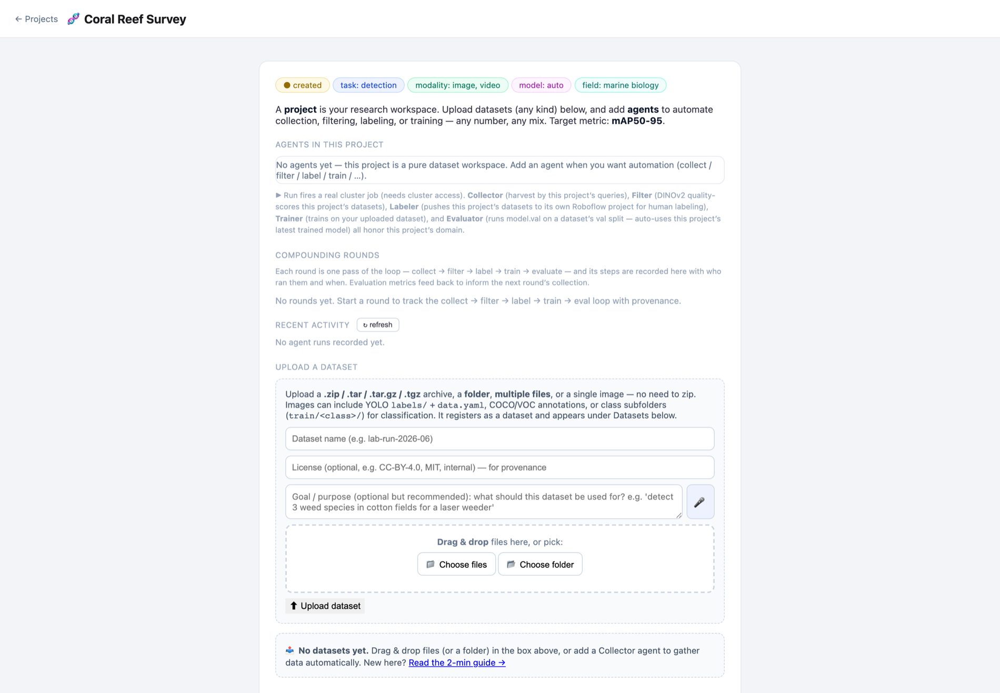
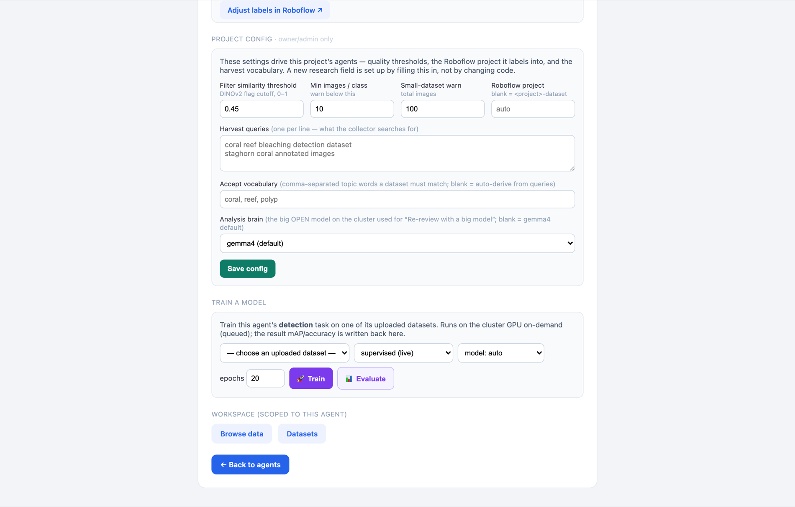
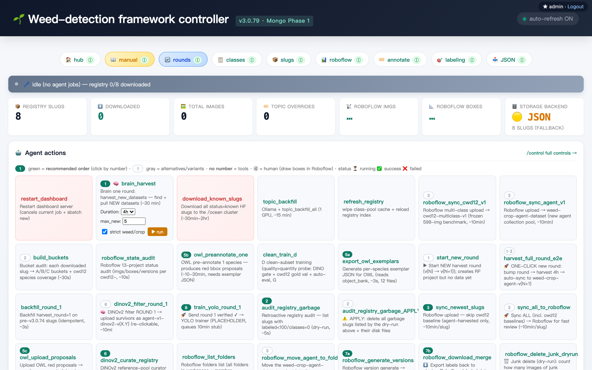
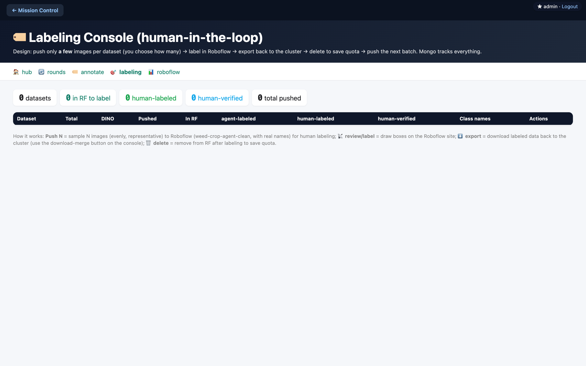
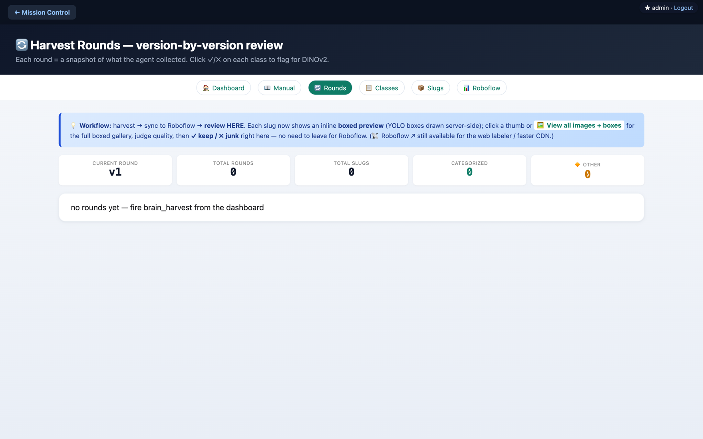

# agentAI

**A research platform for building detection datasets — collect → review → train, all from one dashboard.**

Built at the [MTSU Great Robotics Lab](https://github.com/greatroboticslab). Create a project for any
research field, add data of any kind, then point AI agents at it to **harvest, filter, label, and train** —
any number, any mix, or none. The dashboard runs on the lab server; GPU jobs queue on the PSC Bridges-2 cluster.

<div align="center">

<br>
<sub>Every research domain is a <b>project</b>. Open one, or start a new one for any data type — images, video, sensor, …</sub>
</div>

**Jump to:** [60-second tour](#-60-second-tour) · [Run it locally](#-run-it-locally) · [What's in this repo](#whats-in-this-repo) · [Research &amp; benchmarks](#research--benchmarks)

---

## 🌱 60-second tour — from an empty page to a running project

*Walkthrough of creating a brand-new project from scratch. To show the platform is domain-agnostic (not just
weeds), we spin up a **marine-biology coral-reef survey**.*

### Step 1 — Create a project

From the home screen, click **New Project**. Name it and tick the data types it will hold — or just describe
your goal in plain English (*"collect drone images of coral reefs and train a model to spot bleaching"*) and let
the AI propose the whole setup. No config files, no code.

<div align="center">

</div>

### Step 2 — Land in your workspace

Every project gives you the same tools, scoped to it:

- **Agents** — five kinds you can add in any mix: **Collector** (harvests data by your queries), **Filter** (DINOv2 quality-scores it), **Labeler** (pushes to Roboflow for human labeling), **Trainer** (trains on your data), **Evaluator** (runs `model.val` on a held-out split). A project with *no* agents is just a clean dataset workspace — that's fine too.
- **Compounding rounds** — each round is one pass of `collect → filter → label → train → evaluate`, recorded with who ran it and when; evaluation metrics feed back into the next round's collection.
- **Upload a dataset** — drag-and-drop a `.zip` / folder / images. YOLO (`labels/` + `data.yaml`), COCO/VOC, or class-subfolders are all understood automatically.

<div align="center">

</div>

### Step 3 — It configures itself for your field, then trains

Filling in the research field is all it takes to stand up a new domain — the project **auto-generated harvest
queries** (*"coral reef bleaching detection dataset"*, *"staghorn coral annotated images"*) and an
**accept-vocabulary** (*coral, reef, polyp*) from the words you typed. Tune the quality thresholds if you like,
then **Train** on the cluster GPU (queued) and **Evaluate** — the resulting mAP is written straight back here.

<div align="center">

</div>

### Once data is flowing

The same project surfaces three operating views — the one-click **agent-action grid** (recommended order,
green = the happy path), the human-in-the-loop **labeling console** (push a few → label in Roboflow → export →
repeat), and per-round **review** (keep/junk each round before it reaches training):

<div align="center">

</div>

<div align="center">
<sub>Screenshots are a real <b>local dev instance</b> — the Coral Reef project was created live for this walkthrough;
counts read 0 and cluster-hosted images show placeholders because no data has been harvested yet. On the lab
server the same views fill with real datasets, boxed previews, and round history. There's also a built-in
<b>2-minute guide</b> at <code>/guide</code>.</sub>
</div>

---

## ⚡ Run it locally

```bash
cd weed_llm_benchmark            # the package lives here
pip install -r requirements.txt
echo mypassword > ~/.dashpass    # auth fails closed without a configured password
DASH_USER=me uvicorn weed_optimizer_framework.tools.dashboard_server:app --port 8000
# → open http://localhost:8000  (log in: me / mypassword)
```

---

## What's in this repo

| Path | What it is |
|------|-----------|
| [`weed_llm_benchmark/`](weed_llm_benchmark/) | **The live platform** — dashboard, autonomous harvest → label → train pipeline, MongoDB, Roboflow sync. This is where active work happens. |
| [`multagent/`](multagent/) | **EMACF** robotics agent framework (Brain / Perception / Targeting / Navigation) — the earlier embodied-robot direction, kept for reference. |
| [`docs/`](docs/) | Screenshots + platform roadmap. |

> **Latest:** `v3.1.0` — full-framework audit + CRITICAL correctness/security hardening (holdout-leak seal,
> registry locking, secret removal, honesty fixes). See [`weed_llm_benchmark/CHANGELOG.md`](weed_llm_benchmark/CHANGELOG.md)
> and [`RESEARCH_LOG.md`](RESEARCH_LOG.md).

---

## Research &amp; benchmarks

The platform grew out of two research threads. Full detail is collapsed below to keep this page usable — expand it for the architecture, the 19-model VLM benchmark, every phase, and the results tables.

<details>
<summary><b>📄 Click to expand — EMACF framework, the VLM-vs-YOLO benchmark, all phases &amp; results, tech stack, papers</b></summary>

### Origin

This repository implements **EMACF** (Embodied Multi-Agent Cognitive Framework) — a domain-agnostic agent
architecture where an LLM serves as a robot's "brain" and specialized real-time agents serve as its "body".
The same core infrastructure is designed to handle weed detection, robot navigation, human-robot interaction,
and future applications. The dataset platform above is the weed-detection domain, generalized.

### Repository structure (research view)

| Directory | Description | Status |
|-----------|-------------|--------|
| [`multagent/`](multagent/) | **EMACF core framework** — event-driven multi-agent system extending MetaGPT for real-time robot control. BrainAgent (LLM), PerceptionAgent (YOLO), TargetingAgent (laser), NavigationAgent, cloud-edge comms, real-time dashboard. | Reference |
| [`weed_llm_benchmark/`](weed_llm_benchmark/) | **Vision-LLM benchmark + dataset platform** — evaluates 19 open-source vision LLMs against YOLO on CottonWeedDet12 (5,648 images, 12 species), and hosts the live harvest/label/train platform. | Active |
| `robot_navigation/` | **Robot navigation** *(planned)* — autonomous navigation sharing the same EMACF framework. | Planned |

### Architecture overview

```
┌──────────────────────────────────────────────────────────────────┐
│                    EMACF (multagent/)                             │
│                                                                  │
│  ┌──────────┐  ┌──────────────┐  ┌───────────┐  ┌────────────┐  │
│  │  Brain    │  │  Perception  │  │ Targeting  │  │ Navigation │  │
│  │  Agent    │  │  Agent       │  │ Agent      │  │ Agent      │  │
│  │  (LLM)   │  │  (YOLO)      │  │ (Laser)    │  │ (Movement) │  │
│  └────┬─────┘  └──────┬───────┘  └─────┬─────┘  └──────┬─────┘  │
│       │               │                │               │         │
│       └───────────────┴────────────────┴───────────────┘         │
│                           EventBus                               │
│                              │                                   │
│  ┌───────────────────────────┴────────────────────────────────┐  │
│  │                    Edge Bridge (WebSocket)                  │  │
│  └────────────────────────────────────────────────────────────┘  │
└──────────────────────────────────────────────────────────────────┘
                               │
                    ┌──────────┴──────────┐
                    │   Edge Device       │
                    │   (LaserCar)        │
                    │   Camera + Laser    │
                    │   + Safety Monitor  │
                    └─────────────────────┘
```

### Key design principles

1. **Universal agent framework** — domain logic lives in agent implementations, not the core. The same `EmbodiedTeam`, `EventBus`, and `AgentRegistry` handle any task.
2. **Event-driven** — agents react to events in real time, not turn-based. The BrainAgent (LLM) only intervenes on significant events.
3. **Hot-pluggable agents** — add/remove agents at runtime via `AgentRegistry`.
4. **LLM-agnostic** — switch between vLLM, Ollama, OpenAI, or any backend via config.
5. **Cloud-edge separation** — heavy compute (YOLO, LLM) on cloud GPU; edge device handles only hardware I/O with independent safety fallback.

### Progress — EMACF framework (`multagent/`)

| Component | Status | Description |
|-----------|--------|-------------|
| Core Framework | Done | `EmbodiedTeam`, `EventBus`, `AgentRegistry`, `EdgeBridge` |
| BrainAgent | Done | LLM-based cognitive center with memory and self-optimization |
| PerceptionAgent | Done | YOLO11n detection + tracking + noise filtering + trajectory prediction |
| TargetingAgent | Done | Coordinate transform + firing control + laser patterns |
| NavigationAgent | Done | Mode management + vehicle commands |
| Dashboard | Done | Vue 3 real-time visualization (live feed, agent status, metrics) |
| Edge Client | Done | Camera streaming, command execution, safety monitor |

### Progress — Weed LLM benchmark (`weed_llm_benchmark/`)

| Phase | Status | Description |
|-------|--------|-------------|
| Phase 0: Evaluation Module | Done | `evaluate.py` (mAP, precision, recall), `datasets.py`, format converters |
| Phase 1: YOLO Baseline | **Done** | YOLO11n fine-tuned on CottonWeedDet12 — mAP@0.5=**0.929**, P=0.930, R=0.850 |
| Phase 2: Full LLM Benchmark | **Done** | 15 models evaluated on CottonWeedDet12 (9 with mAP > 0) |
| Phase 3: YOLO+LLM Fusion | **Done** | Only OWLv2 filter improves YOLO (+0.018 F1); LLMs cannot rescue YOLO misses |
| Phase 3B: Cross-Species Generalization | **Done** | YOLO drops 27% on unseen species; Florence-2 precision exceeds YOLO; LLM augmentation +0.009 F1 |
| Phase 3C: Anti-Forgetting Methods | **Done** | All simple methods fail; label quality (SAM+Depth) is the bottleneck |
| Phase 3D: SAM+Depth Enhanced Labeling | **Done** | SAM+Florence-2 caption: worse (-6.8% old, -11% new); caption classification too noisy |
| Phase 3E: Agent Optimizer | **Done** | **First improvement!** Florence+OWLv2 consensus: +0.016 F1 on unseen species, -0.020 forgetting |
| Phase 3F: Florence-2 Fine-tune | **Done** | Negative: fine-tuning degraded both old (-11%) and new species |
| Phase 4: HyperAgent Closed-Loop | **Done** | Qwen2.5-7B Brain: 3 rounds executed, system works but Brain needs stronger reasoning |
| Phase 4B: Weed Optimizer Framework | **Done** | 14 files, 3,522 lines. Ollama function calling, job chain, plant.id API, HuggingFace model discovery. |
| Phase 4C: Clone + Train External Models | **Done** | YOLOv8s trained from COCO→CottonWeed: F1=0.888; DETR zero-shot: F1=0; YOLO11n baseline: F1=0.917 |
| Phase 4D: plant.id Integration | **Done** | API key configured, local test OK (Status 201). Cluster needs pre-cache. 49 credits left. |
| Phase 4E: DeepSeek-R1 Brain | **Done** | 7 action types (vs Qwen's 1). Autonomously searched HuggingFace + downloaded models. |
| Phase 4F: Extended Run (6h48m) | **Done** | 7 rounds autonomous. Filter removed 16.3% label noise. Brain reasoning loop validated. |
| Phase 4G: Anti-Forgetting (LoRA + freeze + distill) | **Done** | Hybrid LoRA: 37 Conv2d layers, 38.15% params. Near-zero mAP forgetting. |
| Phase 4H: Gemma 4 Brain + Evaluator Fix | **Done** | Gemma 4 31B (MoE). Corrected evaluator (dual-conf). New mAP50: +9.7%, old mAP50: -0.6%. |
| Phase 5: Dataset platform (dashboard, provenance, multi-domain) | **Active** | The platform shown at the top of this page. |
| Paper writing | Planned | Figures, tables, manuscript |

#### Benchmark results (CottonWeedDet12, 848 test images)

| Model | Type | mAP@0.5 | mAP@0.5:0.95 | Precision | Recall | F1 | Time |
|-------|------|---------|--------------|-----------|--------|-----|------|
| **YOLO11n** (fine-tuned) | Detector | **0.929** | **0.865** | 0.930 | 0.850 | 0.888 | — |
| Florence-2-base (0.23B) | VLM | **0.434** | **0.392** | **0.789** | 0.519 | 0.626 | 558s |
| Florence-2-large (0.77B) | VLM | 0.329 | 0.302 | 0.692 | 0.431 | 0.531 | 662s |
| InternVL2-8B | VLM | 0.208 | 0.091 | 0.545 | 0.354 | 0.429 | 3838s |
| Qwen2.5-VL-3B | VLM | 0.196 | 0.068 | 0.333 | 0.249 | 0.285 | 5898s |
| MiniCPM-V-4.5 | VLM | 0.192 | 0.043 | 0.407 | 0.340 | 0.371 | 6595s |
| OWLv2-large | Detector | 0.184 | 0.117 | 0.194 | **0.943** | 0.322 | 2519s |
| Qwen2.5-VL-7B | VLM | 0.176 | 0.059 | 0.334 | 0.214 | 0.261 | 6047s |
| InternVL2-2B | VLM | 0.002 | 0.001 | 0.038 | 0.025 | 0.031 | 2094s |
| InternVL2.5-8B | VLM | 0.000 | 0.000 | 0.016 | 0.001 | 0.001 | 6238s |
| Grounding-DINO-base | Detector | 0.000 | 0.000 | — | — | — | 843s |
| Llama 3.2 Vision 11B | VLM | 0.000 | 0.000 | 0.005 | 0.007 | 0.006 | 11370s |
| Moondream / Molmo / LLaVA | VLM | 0.000 | 0.000 | — | — | — | — |

### Technology stack

| Component | Technology |
|-----------|-----------|
| Agent Framework | MetaGPT (extended for embodied AI) |
| Backend | FastAPI + asyncio + WebSocket |
| Object Detection | Ultralytics YOLO11n (fine-tuned on CottonWeedDet12) |
| LLM Integration | vLLM / Ollama / OpenAI-compatible APIs |
| Dashboard | Server-rendered FastAPI (platform) + Vue 3 + ECharts (robot demo) |
| Storage | MongoDB + append-only JSON registry + Roboflow (labeling surface) |
| Hardware | HeliosDAC (laser) + ESP32 (motor/laser control) |
| Compute Cluster | PSC Bridges-2 (V100 GPUs) |

### Papers

1. **"Universal Embodied Multi-Agent Cognitive Framework for Agricultural Robotics"** — EMACF architecture (targeting *Scientific Reports*)
2. **"Can Vision LLMs Detect Weeds? A Benchmark of Open-Source Multimodal Models for Agricultural Object Detection"** — VLM benchmark (targeting *Computers and Electronics in Agriculture*)

### Per-project docs

- [`multagent/README.md`](multagent/README.md) — EMACF setup and usage
- [`weed_llm_benchmark/README.md`](weed_llm_benchmark/README.md) — platform + benchmark framework documentation

</details>

---

## License

Proprietary — research use only. © 2026 MTSU Great Robotics Lab, all rights reserved. See [LICENSE](LICENSE).
